# ROI Algorithm Pipeline — User Manual

**Display Panel Image Processing Tool**
**Version 1.0.0**

Author: Byung Geun (BG) Jun — MR Display Hardware Team
Date: April 2026

---

## Table of Contents

1. [Introduction](#1-introduction)
2. [System Requirements & Installation](#2-system-requirements--installation)
3. [Quick Start Guide](#3-quick-start-guide)
4. [Pipeline Overview](#4-pipeline-overview)
5. [Step-by-Step Walkthrough](#5-step-by-step-walkthrough)
6. [Configuration Reference](#6-configuration-reference)
7. [Python API Reference](#7-python-api-reference)
8. [Output Files](#8-output-files)
9. [Troubleshooting & FAQ](#9-troubleshooting--faq)

---

## 1. Introduction

### What is This Tool?

The **ROI Algorithm Pipeline** is a Python-based image processing tool designed for display panel analysis. It takes a raw camera image of a display panel (captured by a mono camera) and produces a clean, normalized image at display-pixel resolution.

### What Does It Do?

The tool performs the following operations automatically:

1. **Crops** the image to remove unnecessary borders
2. **Detects** the display panel region (ROI) in the camera image
3. **Corrects** perspective distortion (tilt)
4. **Resizes** from camera resolution to display resolution using area-sum averaging
5. **Normalizes** the output to 16-bit dynamic range

### Who Is This For?

- Display hardware engineers who need accurate per-pixel brightness data
- Quality engineers running display panel calibration
- Anyone who needs to convert camera captures to display-resolution data

### Key Features

| Feature | Description |
|---------|-------------|
| Automatic ROI Detection | No manual corner selection needed |
| Pixel Value Preservation | Uses `INTER_NEAREST` interpolation — no data blending |
| Area-Sum Resize | Every camera pixel contributes to the output |
| 16-bit Output | Full dynamic range for precise analysis |
| Modular Design | Each step can be used independently |

---

## 2. System Requirements & Installation

### Prerequisites

- **Python**: 3.8 or higher
- **Operating System**: Windows, macOS, or Linux
- **Input Image**: 16-bit TIF format (mono camera capture)

### Step 1: Install Python Dependencies

Open a terminal and navigate to the project folder:

```bash
cd 20260304_ROI_algorithm
pip install -r requirements.txt
```

The `requirements.txt` includes:
```
numpy>=1.21.0
opencv-python>=4.5.0
matplotlib>=3.4.0
scipy>=1.7.0
pillow>=8.0.0
```

### Step 2: Install Optional Dependencies

For **faster processing** (recommended for large images):
```bash
pip install numba
```

For **documentation generation** (Word & PowerPoint):
```bash
pip install python-pptx python-docx
```

### Step 3: Verify Installation

```bash
python -c "import cv2, numpy, scipy, matplotlib; print('All dependencies OK')"
```

### Project Folder Structure

```
20260304_ROI_algorithm/
├── src/                          # Core pipeline modules
│   ├── __init__.py               # Package exports
│   ├── 1_utils.py                # Utility functions
│   ├── 2_roi_detector.py         # ROI detection
│   ├── 3_image_cropper.py        # Image cropping
│   ├── 4_perspective_warper.py   # Tilt correction
│   ├── 5_area_sum_resizer.py     # Area-sum resize
│   ├── 6_image_normalizer.py     # 16-bit normalization
│   ├── 7_display_panel_processor.py  # Pipeline orchestrator
│   └── main.py                   # CLI entry point
├── data/                         # Input images
│   └── G32_cal.tif               # Sample input
├── output/                       # Generated output files
├── docs/                         # Documentation
└── requirements.txt              # Python dependencies
```

---

## 3. Quick Start Guide

### Run with Default Settings (Fastest Way)

```bash
python src/main.py
```

This processes the sample image `data/G32_cal.tif` with default settings and saves results to `output/`.

**Expected output:**
```
============================================================
Display Panel Processing Pipeline
============================================================

[Step 1] Loading image...
  Original image: 14144 x 10640 pixels
  Dtype: uint16, Range: [0, 2437]

[Step 2] Cropping image...
  Crop region: (1700, 300) to (11700, 9900)
  Cropped image: 10000 x 9600 pixels

[Step 3] Detecting ROI...
  Detected ROI: 9374 x 8894 pixels
  Tilt angle: -0.03 degrees

[Step 4] Applying perspective warp...
  Warped image: 9374 x 8894 pixels

[Step 5] Resizing to display resolution...
  Target size: 2412 x 2288 pixels

[Step 6] Normalizing to 16-bit...
  Normalized range: [0, 65535]

============================================================
Processing Complete!
============================================================
```

### Run with Custom Settings

**Use a different input image:**
```bash
python src/main.py --input path/to/your/image.tif
```

**Save output to a different folder:**
```bash
python src/main.py --output results/
```

**Set custom display resolution:**
```bash
python src/main.py --width 1920 --height 1080
```

**Adjust ROI detection threshold:**
```bash
python src/main.py --threshold 100
```

**Skip image cropping (use the full image):**
```bash
python src/main.py --no-crop
```

**Full example with all options:**
```bash
python src/main.py ^
    --input data/G32_cal.tif ^
    --output output/ ^
    --width 2412 ^
    --height 2288 ^
    --threshold 50 ^
    --crop-x-start 1700 ^
    --crop-y-start 300 ^
    --crop-x-end 11700 ^
    --crop-y-end 9900
```

---

## 4. Pipeline Overview

The processing pipeline transforms a raw camera image through 5 stages:

```
┌─────────────────────┐
│   Original Image    │  14144 x 10640 px, 16-bit
│   (G32_cal.tif)     │
└──────────┬──────────┘
           │
           ▼
┌─────────────────────┐
│   Step 1: Crop      │  Region: (1700,300) → (11700,9900)
│ (ImageCropper)      │  Output: 10000 x 9600 px
└──────────┬──────────┘
           │
           ▼
┌─────────────────────┐
│  Step 2: ROI Detect │  Threshold → Morphology → Contour → Corners
│ (ROIDetector)       │  Output: 9374 x 8894 px ROI
└──────────┬──────────┘
           │
           ▼
┌─────────────────────┐
│  Step 3: Warp       │  4-corner perspective transform
│ (PerspectiveWarper) │  INTER_NEAREST (preserves pixel values)
└──────────┬──────────┘
           │
           ▼
┌─────────────────────┐
│  Step 4: Resize     │  Camera pixels → Display pixels
│ (AreaSumResizer)    │  Scale: ~3.89x → 2412 x 2288 px
└──────────┬──────────┘
           │
           ▼
┌─────────────────────┐
│  Step 5: Normalize  │  Map to [0, 65535] range
│ (ImageNormalizer)   │  Output: 2412 x 2288 px, uint16
└─────────────────────┘
```

### Pipeline Visualization

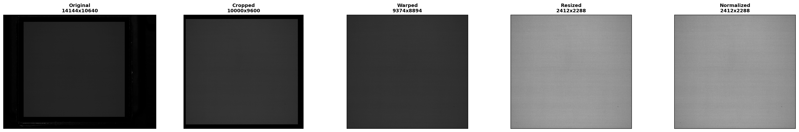

### Architecture Diagram

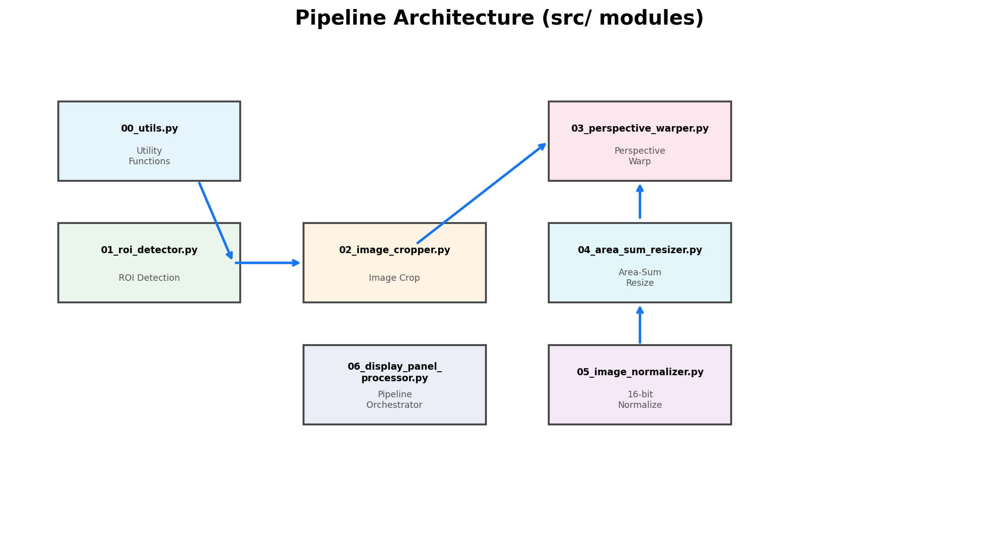

---

## 5. Step-by-Step Walkthrough

### Step 0: Load Original Image

The pipeline starts by loading the 16-bit TIF image captured by the mono camera.

**Module:** `src/1_utils.py`

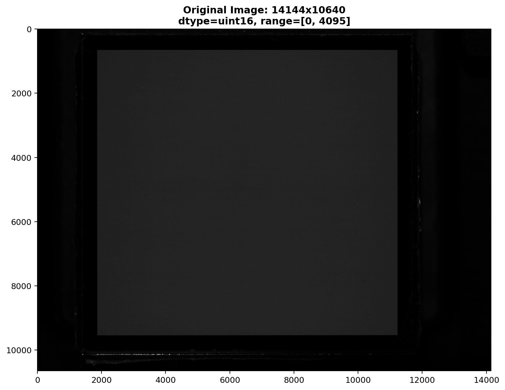

**Image properties:**
- Resolution: 14144 x 10640 pixels
- Format: 16-bit grayscale (uint16)
- File: `data/G32_cal.tif`

The histogram shows the pixel value distribution. The red dashed line marks the threshold used for ROI detection:

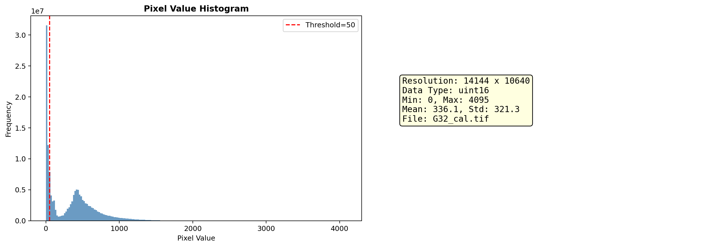

---

### Step 1: Image Cropping

Removes the unnecessary border regions to speed up processing and eliminate noise.

**Module:** `src/3_image_cropper.py`
**Classes:** `ImageCropper`, `CropRegion`

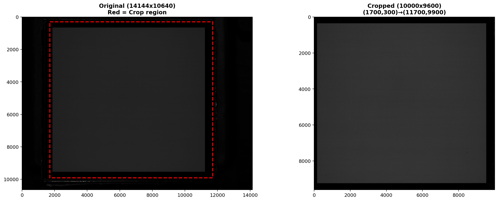

**Default crop region:** `(1700, 300) → (11700, 9900)`
- Original: 14144 x 10640 → Cropped: 10000 x 9600

**Code example:**
```python
from src import ImageCropper, CropRegion

cropper = ImageCropper(CropRegion(1700, 300, 11700, 9900))
cropped = cropper.crop(image)
print(f"Cropped: {cropped.shape[1]} x {cropped.shape[0]}")
```

---

### Step 2: ROI Detection

Automatically finds the display panel boundary in the cropped image.

**Module:** `src/2_roi_detector.py`
**Class:** `ROIDetector`

**Algorithm:**
1. **Binarize** — Pixels above threshold → white, below → black
2. **Morphological close** (51×51 kernel) — Fills small holes
3. **Morphological open** (51×51 kernel) — Removes protrusions
4. **Hole fill** — `scipy.ndimage.binary_fill_holes()`
5. **Find contours** — Extracts the largest contour
6. **Minimum area rectangle** — Computes 4 corners

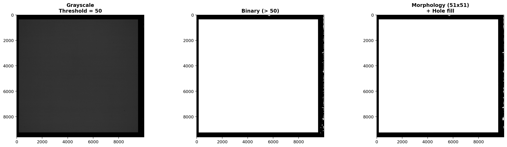

The detected corners are ordered as TL (top-left), TR (top-right), BR (bottom-right), BL (bottom-left):

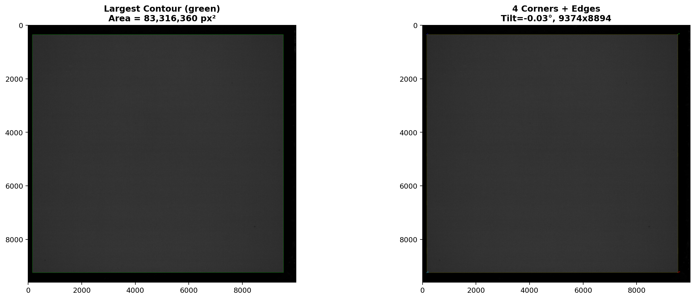

**Corner coordinates and ROI info:**

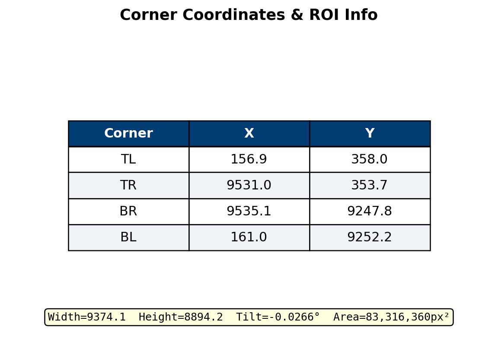

**Code example:**
```python
from src import ROIDetector

detector = ROIDetector(threshold=50, morph_kernel_size=51)
roi = detector.detect(cropped_image)

if roi is not None:
    print(f"Corners: {roi.corners}")
    print(f"Tilt angle: {roi.angle:.4f}°")
    print(f"Size: {roi.width:.0f} x {roi.height:.0f}")
    print(f"Area: {roi.area:,.0f} px²")
```

---

### Step 3: Perspective Correction

Corrects the tilt of the display panel using a perspective transform.

**Module:** `src/4_perspective_warper.py`
**Class:** `PerspectiveWarper`

**Key feature:** Uses `INTER_NEAREST` interpolation to **preserve original pixel values**. This is critical for measurement accuracy — bilinear or bicubic interpolation would blend neighboring pixel values.

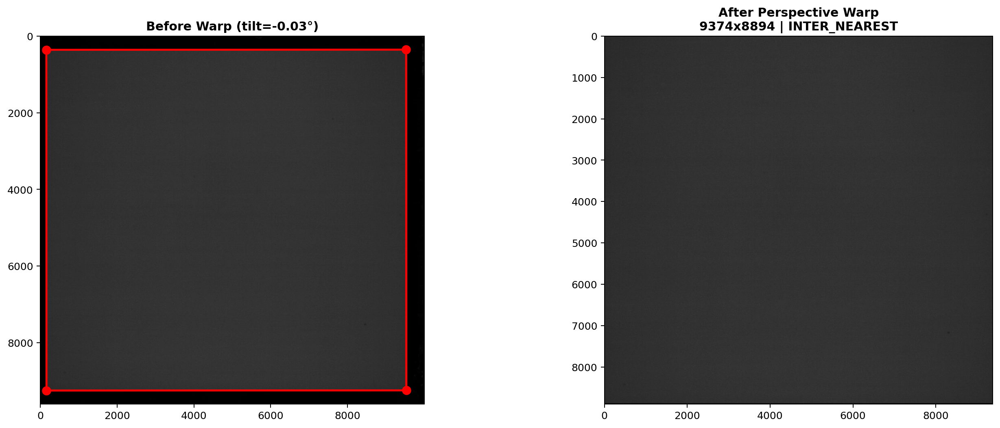

**Transform matrix and corner mapping details:**

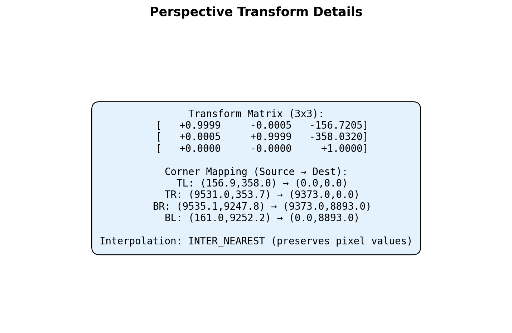

**Code example:**
```python
from src import PerspectiveWarper
import cv2

warper = PerspectiveWarper(interpolation=cv2.INTER_NEAREST)
warp_result = warper.warp(cropped, roi.corners)

warped_image = warp_result.image
print(f"Size: {warp_result.width} x {warp_result.height}")
print(f"Transform matrix:\n{warp_result.transform_matrix}")
```

---

### Step 4: Area-Sum Resize

Converts the camera-resolution image to display-pixel resolution.

**Module:** `src/5_area_sum_resizer.py`
**Class:** `AreaSumResizer`

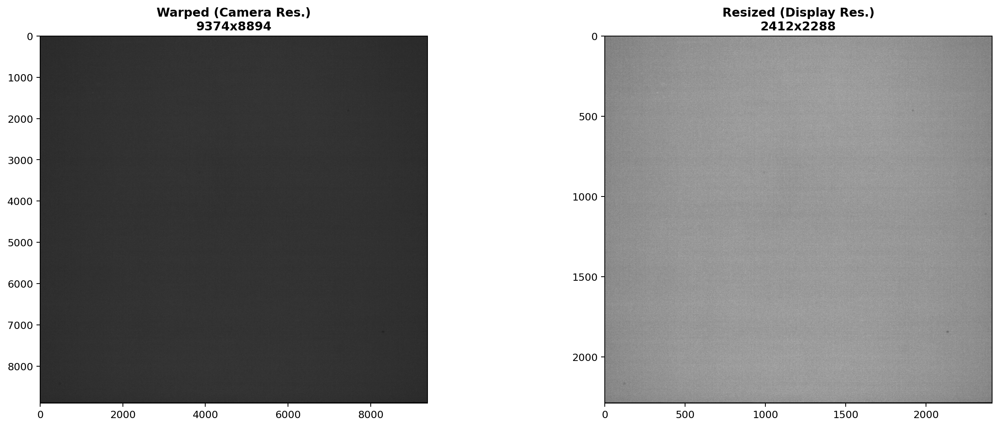

**How it works:**
Each display pixel corresponds to approximately 3.89 × 3.89 camera pixels. The Area-Sum method computes a weighted average of **all** camera pixels within each display pixel's footprint:

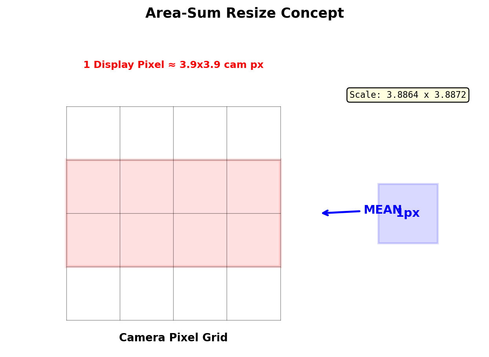

**Why Area-Sum instead of standard resize?**
- Standard resize (bilinear/bicubic) **alters** pixel values through interpolation
- Area-Sum **preserves** the total light energy — every camera pixel contributes
- Essential for accurate display measurement data

**Zoom comparison — Camera pixels vs. Display pixels:**

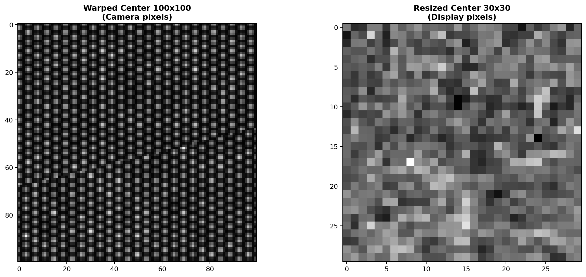

**Code example:**
```python
from src import AreaSumResizer

resizer = AreaSumResizer(show_progress=True)
result = resizer.resize(warped_image, (2412, 2288))

print(f"Scale X: {result.scale_x:.4f}")
print(f"Scale Y: {result.scale_y:.4f}")
print(f"Pixels per output: {result.pixels_per_output:.2f}")
```

---

### Step 5: 16-bit Normalization

Maps the output pixel values to the full 16-bit range [0, 65535].

**Module:** `src/6_image_normalizer.py`
**Class:** `ImageNormalizer`

**Formula:** `output = (pixel - min) / (max - min) × 65535`

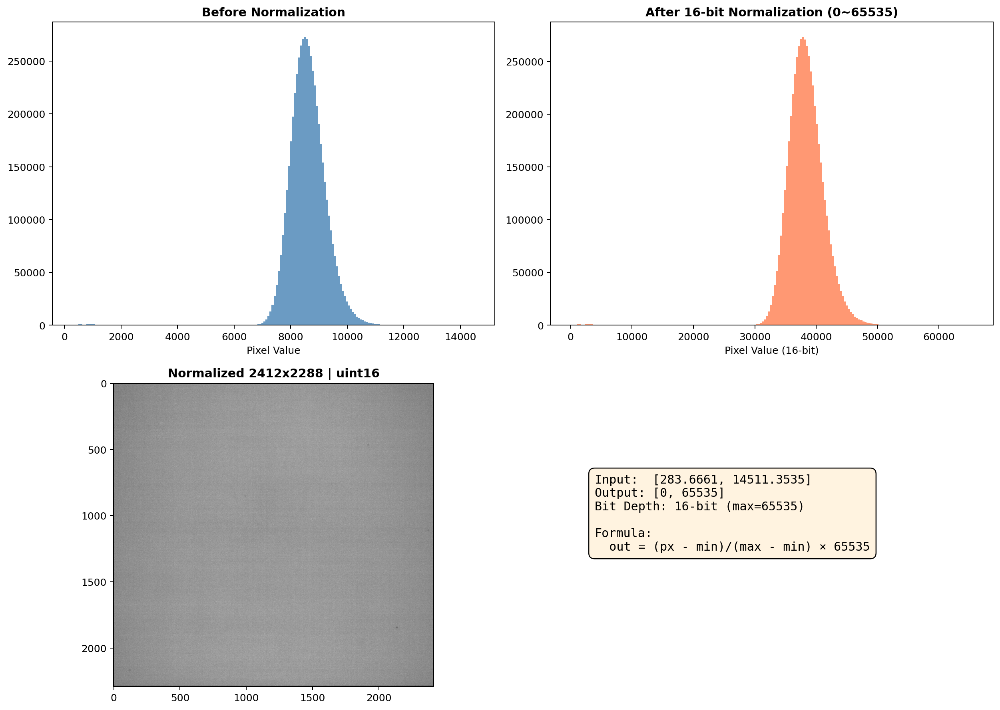

**Code example:**
```python
from src import ImageNormalizer

normalizer = ImageNormalizer(bit_depth=16)
result = normalizer.normalize(resized_image)

print(f"Input range: [{result.original_min:.2f}, {result.original_max:.2f}]")
print(f"Output range: [{result.normalized_min}, {result.normalized_max}]")

# Quick conversions
img_16bit = normalizer.normalize_to_16bit(image)
img_8bit = normalizer.normalize_to_8bit(image)
```

---

## 6. Configuration Reference

### CLI Options

| Option | Short | Default | Description |
|--------|-------|---------|-------------|
| `--input` | `-i` | `data/G32_cal.tif` | Input image path |
| `--output` | `-o` | `output` | Output directory |
| `--width` | `-W` | `2412` | Target display width (pixels) |
| `--height` | `-H` | `2288` | Target display height (pixels) |
| `--threshold` | `-t` | `50` | ROI detection threshold |
| `--crop-x-start` | | `1700` | Crop region X start |
| `--crop-y-start` | | `300` | Crop region Y start |
| `--crop-x-end` | | `11700` | Crop region X end |
| `--crop-y-end` | | `9900` | Crop region Y end |
| `--no-crop` | | *(off)* | Disable image cropping |
| `--no-intermediates` | | *(off)* | Don't save intermediate files |

### ProcessingConfig Parameters

When using the Python API, all settings are controlled via `ProcessingConfig`:

```python
from src import ProcessingConfig

config = ProcessingConfig(
    # Crop settings
    crop_x_start=1700,     # X start of crop region
    crop_y_start=300,      # Y start of crop region
    crop_x_end=11700,      # X end of crop region
    crop_y_end=9900,       # Y end of crop region
    use_crop=True,         # Enable/disable cropping

    # ROI detection
    roi_threshold=50,      # Binarization threshold
    morph_kernel_size=51,  # Morphological kernel size

    # Display settings
    display_width=2412,    # Target display width
    display_height=2288,   # Target display height

    # Output settings
    output_bit_depth=16,   # Output bit depth (8 or 16)
    save_intermediates=True # Save intermediate files
)
```

### How to Choose the Right Threshold

The `roi_threshold` parameter controls how the pipeline distinguishes the display area from the background:

| Threshold | When to Use |
|-----------|-------------|
| 30–50 | Low-brightness display panels or dim captures |
| 50–100 | Standard display panels (default: 50) |
| 100–200 | High-brightness panels with clear boundaries |
| 200+ | Very bright panels with strong background noise |

**Tip:** Check the histogram of your image to find the best threshold. The threshold should sit in the valley between the background peak and the display peak.

---

## 7. Python API Reference

### Full Pipeline (Recommended)

```python
from src import DisplayPanelProcessor, ProcessingConfig

# Step 1: Configure
config = ProcessingConfig(
    display_width=2412,
    display_height=2288
)

# Step 2: Create processor
processor = DisplayPanelProcessor(config)

# Step 3: Process image
result = processor.process("data/G32_cal.tif")

# Step 4: Save results
processor.save_results(result, "output/")
processor.save_visualization(result, "output/")

# Step 5: Access results
print(f"Original:   {result.original_image.shape}")
print(f"Cropped:    {result.cropped_image.shape}")
print(f"Warped:     {result.warped_image.shape}")
print(f"Resized:    {result.resized_image.shape}")
print(f"Normalized: {result.normalized_image.shape}")
print(f"Tilt angle: {result.stats['tilt_angle']:.4f}°")
```

### Using Individual Modules

Each module can be used independently:

```python
import cv2
from src import (
    ImageCropper, CropRegion,
    ROIDetector,
    PerspectiveWarper,
    AreaSumResizer,
    ImageNormalizer
)

# Load image
image = cv2.imread("data/G32_cal.tif", cv2.IMREAD_UNCHANGED)

# 1. Crop
cropper = ImageCropper(CropRegion(1700, 300, 11700, 9900))
cropped = cropper.crop(image)

# 2. Detect ROI
detector = ROIDetector(threshold=50, morph_kernel_size=51)
roi = detector.detect(cropped)

# 3. Perspective warp
warper = PerspectiveWarper(interpolation=cv2.INTER_NEAREST)
warp_result = warper.warp(cropped, roi.corners)
warped = warp_result.image

# 4. Area-sum resize
resizer = AreaSumResizer(show_progress=True)
resize_result = resizer.resize(warped, (2412, 2288))
resized = resize_result.image

# 5. Normalize
normalizer = ImageNormalizer(bit_depth=16)
norm_result = normalizer.normalize(resized)
final = norm_result.image

# Save
cv2.imwrite("final_output.tif", final)
```

### Adaptive ROI Detector (Advanced)

For images with varying edge contrast across different corners:

```python
from src import AdaptiveROIDetector

detector = AdaptiveROIDetector(
    initial_threshold=200,
    corner_region_size=60,
    threshold_range=(50, 600),
    threshold_step=20,
    display_pixel_pitch=(3.5, 3.5),
    align_to_display_grid=True
)

# Adaptive detection
roi = detector.detect_adaptive(cropped)

# Or with grid alignment
roi = detector.detect_with_grid_alignment(cropped)

# Per-corner thresholds
print(detector.get_corner_thresholds())
# {'TL': 120, 'TR': 140, 'BR': 160, 'BL': 130}
```

---

## 8. Output Files

After running the pipeline, these files are created in the output directory:

| File | Description | Format |
|------|-------------|--------|
| `00_cropped_image.tif` | Cropped region from original | 16-bit TIF |
| `04_warped_image.tif` | Perspective-corrected image | 16-bit TIF |
| `05_resized_image.tif` | Area-sum resized to display resolution | 16-bit TIF |
| `06_final_normalized.tif` | **Main output** — 16-bit normalized | 16-bit TIF |
| `06_final_normalized_preview.png` | 8-bit preview for quick viewing | 8-bit PNG |
| `06_final_comparison.png` | Side-by-side comparison of stages | PNG |

### How to View the Output

**16-bit TIF files** cannot be viewed in standard image viewers (they appear black or white). Use:

- **ImageJ/FIJI**: Open → Auto Brightness/Contrast
- **Python**: `cv2.imread("file.tif", cv2.IMREAD_UNCHANGED)`
- **MATLAB**: `imread('file.tif')`

**PNG preview** (`06_final_normalized_preview.png`) is the quick-viewing option — it's an 8-bit version that can be opened in any image viewer.

---

## 9. Troubleshooting & FAQ

### Common Issues

**Q: "No ROI detected" error**
- **Cause:** The threshold is too high or too low for your image
- **Fix:** Try different threshold values. Check the image histogram to find the right cutoff:
  ```bash
  python src/main.py --threshold 30
  python src/main.py --threshold 100
  ```

**Q: Output looks all black or all white**
- **Cause:** You're viewing a 16-bit TIF in a standard viewer
- **Fix:** Use the PNG preview file, or open in ImageJ with Auto Brightness/Contrast

**Q: Processing is very slow**
- **Cause:** `numba` is not installed — Python fallback loops are used
- **Fix:** Install numba for 10-100x speedup:
  ```bash
  pip install numba
  ```

**Q: "Could not load image" error**
- **Cause:** The input file path is incorrect or the file doesn't exist
- **Fix:** Check the path and make sure OpenCV can read the file format

**Q: Display resolution doesn't match my panel**
- **Fix:** Specify your panel's resolution:
  ```bash
  python src/main.py --width YOUR_WIDTH --height YOUR_HEIGHT
  ```

**Q: The crop region doesn't fit my image**
- **Fix:** Adjust crop coordinates or disable cropping:
  ```bash
  python src/main.py --no-crop
  # Or set custom crop:
  python src/main.py --crop-x-start 0 --crop-y-start 0 --crop-x-end 5000 --crop-y-end 5000
  ```

**Q: Tilt angle seems wrong**
- **Cause:** Morphological kernel is too small/large for your image
- **Fix:** Adjust via Python API:
  ```python
  config = ProcessingConfig(morph_kernel_size=31)  # smaller kernel
  ```

---

## Document Generation

To regenerate this documentation with updated images:

```bash
# Generate intermediate visualization images
python docs/generate_images.py

# Generate PowerPoint user manual
python docs/create_user_manual_ppt.py

# Generate Word document user manual
python docs/create_user_manual_doc.py
```

---

*ROI Algorithm Pipeline v1.0.0 — Internal use only — Meta Platforms, Inc.*
